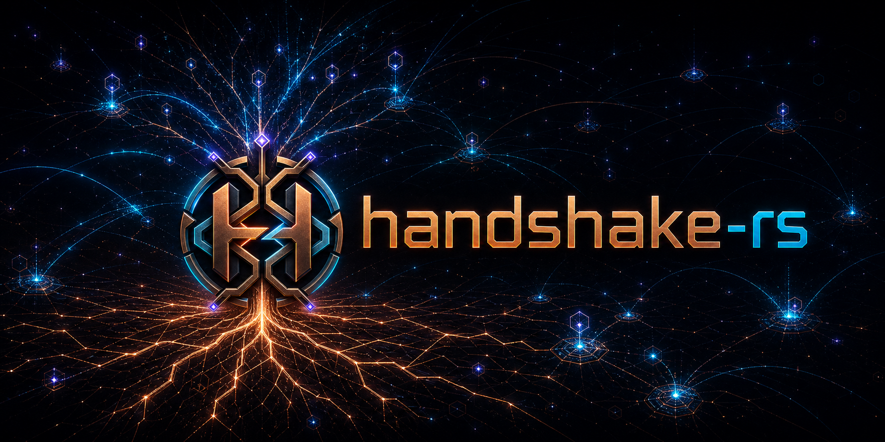

<p align="center">
  
</p>

<h1 align="center">Handshake Rust Ecosystem</h1>

<p align="center">
  <strong>Sovereign naming. Systems-grade Rust. Infrastructure without gatekeepers.</strong>
</p>

`handshake-rs` is an independent, community-led collection of Rust libraries,
services, and applications for Handshake. Each product has its own repository,
version history, qualification gates, license, and release boundary. The
[`ecosystem`](https://github.com/handshake-rs/ecosystem) repository coordinates
cross-project architecture and evidence; it is not a monorepo or umbrella
package.

## Projects

| Repository | Responsibility |
| --- | --- |
| [`hns-rs`](https://github.com/handshake-rs/hns-rs) | Runtime-independent consensus, transaction, covenant, proof, swap, Shakescape V1, HNSA, and HNSR protocol primitives. It defines wire and state-machine boundaries; it does not operate a node, wallet, relay, or market. |
| [`hns-node-rs`](https://github.com/handshake-rs/hns-node-rs) | Standalone `hsrd` node with chain state, P2P sync, mempool, mining templates, RPC, resolver support, wallet indexes, and an opaque HNSR swap-circuit relay. Relaying bytes does not grant wallet, marketplace, or settlement authority. |
| [`hns-wallet-rs`](https://github.com/handshake-rs/hns-wallet-rs) | Encrypted HNS wallet, direct peer controller, Bitcoin support, closed Shakedex workflows, provider types, host/FFI boundaries, and mobile controllers. The published package is independently versioned from its consumers. |
| [`hns-dane-engine`](https://github.com/handshake-rs/hns-dane-engine) | Canonical DNS wire, DNSSEC, TLSA/DANE, dual-root resolution, browser authority lifecycle, transport policy, observability, and HNSA/HNSR admission contracts. Product roles remain downstream integration decisions. |
| [`hns-dane-browser-mobile`](https://github.com/handshake-rs/hns-dane-browser-mobile) | Shakescape for Android and iOS: authenticated HNS/ICANN browsing plus native direct-wallet reads, send review/broadcast, name transfers, and closed Shakedex offer exchange. Website-provider access and active HNSA/HNSR roles remain disabled. |
| [`hns-dane-browser-extension`](https://github.com/handshake-rs/hns-dane-browser-extension) | Shakescape Extension, its Chromium MV3 UI, authenticated loopback proxy/native host, and cross-platform Setup application. It can request the optional DNS-relay transport but does not serve opaque relay traffic or expose wallet/provider/market authority. |
| [`MeshMine`](https://github.com/handshake-rs/MeshMine) | Private mining-overlay workspace consuming the node and protocol layers. Its `pool-stats` work is specialized and does not make it a wallet, exchange, order book, or general marketplace. |
| [`hns-dane-crawler`](https://github.com/handshake-rs/hns-dane-crawler) | Observational HSD-derived topology, stored DNS evidence, DANE-readiness queues, reports, and optional directory output. Observations are not browser trust authority. |
| [`hns-dane-bootstrap-generator`](https://github.com/handshake-rs/hns-dane-bootstrap-generator) | Operator tooling for HNS/ICANN delegation, DNSSEC/DS, authoritative DoH, TLSA, and appliance configuration. Generated guidance is not live validation or transaction authority. |
| [`ecosystem`](https://github.com/handshake-rs/ecosystem) | Source audits, compatibility records, qualification matrices, migration notes, and historical release evidence across the separate repositories. |

## How the pieces fit

```text
hns-rs ─┬──> hns-node-rs ──────> MeshMine
        ├──> hns-wallet-rs ─────> Shakescape mobile
        └──> hns-dane-engine ─┬─> Shakescape mobile
                             └─> Shakescape Extension

hns-node-rs ── typed chain/RPC adapter ──> hns-wallet-rs

hns-dane-crawler ── observed gap ──> hns-dane-bootstrap-generator

ecosystem ── audits compatibility, qualification, and release evidence
```

Authority follows those arrows deliberately. Protocol types do not activate a
service; node or relay state does not become wallet signing authority; and a
crawler observation or generated record does not become browser trust
evidence. Both browser products resolve through HNS and ICANN and validate the
selected DNSSEC, TLSA, and DANE evidence locally.

## Current source and release inventory

Snapshot: **2026-09-02**. `Code source` identifies the last reviewed
code-bearing head. `Docs audit` identifies the repository head after this
cross-project documentation reconciliation. A tag or package publication is
reported only where the repository retains that evidence. The same data is
available in
[`ecosystem-release-inventory.json`](./ecosystem-release-inventory.json).

| Repository | Code source | Docs audit | Current version | Release state |
| --- | --- | --- | --- | --- |
| `hns-rs` | [`73611a0`](https://github.com/handshake-rs/hns-rs/commit/73611a0d83778e157b35f28ca2197d068e83fc61) (`73611a0d83778e157b35f28ca2197d068e83fc61`) | `2408c1e2aada1e47f7b89bbd1dc4954cf133ea77` | `0.4.1` | The 17-crate cohort and `v0.4.1` are published. |
| `hns-wallet-rs` | [`747d550`](https://github.com/handshake-rs/hns-wallet-rs/commit/747d550736f10a6b186f0d042b1a53c8bf7a5fba) (`747d550736f10a6b186f0d042b1a53c8bf7a5fba`) | `268830db27d0dbaa90580b456903248f053c7a21` | `0.2.1` | The 14-crate cohort and `v0.2.1` are published. |
| `hns-node-rs` | [`c99dffa`](https://github.com/handshake-rs/hns-node-rs/commit/c99dffa9186066ea92aa96ea836fa2d51c2790e1) (`c99dffa9186066ea92aa96ea836fa2d51c2790e1`) | `5c0c6c5a060562c282f9e2adf921f25f440c3856` | `0.3.5` | `0.3.5` remains untagged; `v0.3.4` is the latest source tag. |
| `MeshMine` | [`30be371`](https://github.com/handshake-rs/MeshMine/commit/30be371bc6643a358b1ee8c2306378ef4543c4a8) (`30be371bc6643a358b1ee8c2306378ef4543c4a8`) | `30be371bc6643a358b1ee8c2306378ef4543c4a8` | `0.1.0` | Private, non-publishable workspace with no release tag. |
| `hns-dane-engine` | [`87d2346`](https://github.com/handshake-rs/hns-dane-engine/commit/87d2346c13ade4987801e0f1367bd604fd77c9f0) (`87d2346c13ade4987801e0f1367bd604fd77c9f0`) | `ac07911c5f5f558722c4c4f13a97099597049edc` | `0.2.2` | Mixed exact published component cohort across `0.2.x` and `0.3.0`; root tag `v0.2.2`. |
| `hns-dane-browser-mobile` | [`7c1e952`](https://github.com/handshake-rs/hns-dane-browser-mobile/commit/7c1e9521fbd6df3c1a29437c6b08e25e13c37e1e) (`7c1e9521fbd6df3c1a29437c6b08e25e13c37e1e`) | `e79aa66ab1e760b90cb1b39b1988947430e6f204` | `1.0.4` | Android code 56 is committed to the Play production track; iOS build 65 is valid and waiting for review. Latest source tag is `v1.0.2`. |
| `hns-dane-browser-extension` | [`2b6bf2f`](https://github.com/handshake-rs/hns-dane-browser-extension/commit/2b6bf2faf87f7bd14e07db3f21a13423b7d75f39) (`2b6bf2faf87f7bd14e07db3f21a13423b7d75f39`) | `9a73d4f590698b098b70e77689d6e956ce94e509` | `1.0.0` | Extension/native Setup source is `1.0.0`; `v0.5.9` remains the latest source tag. |
| `hns-dane-crawler` | [`1a290ef`](https://github.com/handshake-rs/hns-dane-crawler/commit/1a290efa394a2b28e958fb94d556719199bb00dd) (`1a290efa394a2b28e958fb94d556719199bb00dd`) | `1a290efa394a2b28e958fb94d556719199bb00dd` | `0.1.0` | Untagged `denuo-hns-topology` package candidate. |
| `hns-dane-bootstrap-generator` | [`65cc8aa`](https://github.com/handshake-rs/hns-dane-bootstrap-generator/commit/65cc8aa1335d7a0e0299c31a96e824a702914869) (`65cc8aa1335d7a0e0299c31a96e824a702914869`) | `65cc8aa1335d7a0e0299c31a96e824a702914869` | `0.2.2` | Private application; `v0.2.1` remains the latest source tag. |

These are source and distribution coordinates, not a claim that the ecosystem
is qualified as one product. Repository-local release documents remain the
authority for artifacts, CI runs, installed-device evidence, and open gates.

## Browser product boundaries

Shakescape mobile `1.0.4` includes the published `hns-rs 0.4.1` and
`hns-wallet-rs 0.2.1` closures. Its native direct-wallet path supports local
wallet lifecycle, synchronized balance and history, distinct receive targets,
send review and broadcast, tracked names, transfer/finalization, and closed
Shakedex offer exchange. Explicit IP-literal Shakescape V1 pairing and the
wallet-owned listener are revoked when the wallet locks or the app crosses a
protected lifecycle boundary.

Those native capabilities do not create a website provider. Web content cannot
request wallet actions, and active HNSA/HNSR browser roles and mainnet
cross-chain settlement remain disabled. Physical-iPhone coverage and installed
cross-chain swap qualification also remain open.

Shakescape Extension `1.0.0` integrates the published browser-engine component
graph and keeps its optional requester-only P2P DNS relay behind explicit
consent. It opts out of opaque relay serving. Wallet authority, a website
provider, value settlement, marketplace operation, HNSA/HNSR service roles,
and a verified MeshMine feed remain unavailable in the Chromium product.

The node's `0x0004` swap circuit is an opaque relay boundary. Enabled relayers
may advertise Node, Web, Chat, and Shakescape swap profiles, while requesters
use their selected profile. The node neither decodes marketplace payloads nor
gains discovery, order-book, wallet, approval, funding, or settlement
authority from relaying them.

## Related product boundary

The separately maintained `denuoweb/namehold-wallet` mirror remains at
[`60f10f9`](https://github.com/denuoweb/namehold-wallet/commit/60f10f91e6f856e4620bfd1b430dd1eb3a08a1a5)
(`60f10f91e6f856e4620bfd1b430dd1eb3a08a1a5`), version `0.4.0`. It is an
hsd-backed desktop wallet, not the `hns-wallet-rs` mobile stack. Existing
updater and public `v0.4.0` release authority remains with
`DimazzzZ/namehold-wallet`.

## Source governance and maturity

Canonical source and review policy live in the individual `handshake-rs`
repositories. Release publishing, application-store submission, and binary
signing are distinct responsibilities. Denuo Web LLC may publish or sign
browser products and auxiliary services without receiving organization-wide
source ownership. Artifacts must identify their exact source commit or tag.

The ecosystem is under active construction and is **not release-ready as a
whole**. A passing primitive, crate, or portable build does not imply
installed-browser, wallet-value, marketplace, signed-device, mainnet, or
production qualification. Consult the ecosystem
[`qualification matrix`](https://github.com/handshake-rs/ecosystem/blob/main/QUALIFICATION_MATRIX.md),
[`remaining gaps`](https://github.com/handshake-rs/ecosystem/blob/main/REMAINING_GAPS.md),
and
[`integration state`](https://github.com/handshake-rs/ecosystem/blob/main/INTEGRATION_STATE.md)
for the current cross-project view.

License terms differ by repository. Public source availability alone does not
grant additional rights; consult each repository's license and third-party
notices before redistribution.

> This is an independent project and does not claim to be the official
> Handshake organization.

The canonical [brand assets](./assets/README.md) are maintained with this
profile.
